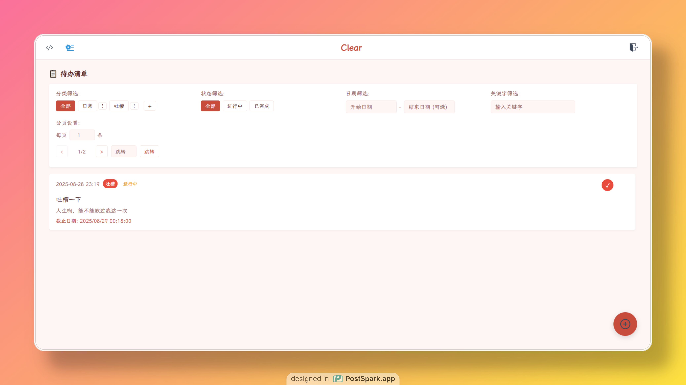

# Clear

<p align="center">
  
</p>

<p align="center">
  <strong>简洁之美，效率之选</strong>
</p>

<p align="center">
  <a href="https://clear.1wind.cn/">🌐 在线体验</a> 
</p>

---

## 🎯 项目简介

Clear 是一款现代化的待办事项管理应用，采用全栈架构设计，致力于为用户提供简洁、高效的任务管理体验。无论是个人日常规划还是团队协作，Clear 都能满足您的需求。

### ✨ 核心特性

- **🎨 精美界面** - 响应式设计，支持多种主题切换
- **📝 智能管理** - 任务分类、标签系统、优先级设置
- **🔐 安全可靠** - JWT认证，数据加密存储
- **⚡ 高性能** - 前后端分离，API响应快速
- **💾 极低占用** - 仅需 4MB 内存运行，50MB 硬盘空间
- **🗄️ 数据独立** - SQLite本地存储，数据完全掌控，随时备份迁移
- **🐳 容器化** - Docker部署，一键启动
- **📱 全平台** - 桌面端、移动端样式完美适配

## 🛠️ 技术栈

### 前端技术
- **Vue 3** - 渐进式JavaScript框架
- **TypeScript** - 类型安全的JavaScript超集
- **Vite** - 下一代前端构建工具
- **Pinia** - Vue.js状态管理库
- **Element Plus** - Vue 3组件库

### 后端技术
- **Go 1.24+** - 高性能后端服务
- **Gin** - 轻量级Web框架
- **GORM** - Go语言ORM库
- **SQLite** - 轻量级数据库
- **JWT** - 身份认证机制

### 开发工具
- **Docker** - 容器化部署
- **Docker Compose** - 多容器应用编排
- **pnpm** - 高效的包管理器

## 🚀 快速开始

### 📦 生产环境部署（推荐）

**👉 [前往 Releases 页面获取最新版本并部署](https://github.com/WindyDante/Clear/releases/latest)**

Releases 页面为您提供：

#### 🐳 Docker 部署
- ✅ **一键启动** - 复制粘贴即可运行
- ✅ **多架构支持** - 自动适配 AMD64/ARM64
- ✅ **生产就绪** - 完整的 Docker Compose 配置

#### 🖥️ 二进制部署  
- ✅ **Linux 服务器** - 支持 AMD64 和 ARM64 架构
- ✅ **详细步骤** - 包含完整的部署指南
- ✅ **轻量高效** - 无需额外依赖，直接运行

> 💡 **为什么选择 Releases 部署？**  
> Releases 提供经过测试的稳定版本，包含预编译的二进制文件和优化的 Docker 镜像，部署更简单、更可靠。

### 🛠️ 本地开发体验

如果您想快速体验或进行本地开发，可以使用本仓库的开发环境：

```bash
# 快速体验（Docker）
git clone https://github.com/WindyDante/Clear.git
cd Clear
docker-compose up -d

# 访问地址: http://localhost:6277
```

**开发 vs 生产部署对比：**

| 方式 | 适用场景 | 优势 | 劣势 |
|------|----------|------|------|
| 📦 Releases 部署 | 生产环境、正式使用 | 稳定、优化、简单 | - |
| 🛠️ 本地开发 | 体验功能、二次开发 | 最新代码、可定制 | 需要构建环境 |

---

**🎯 准备部署？[立即前往 Releases 页面](https://github.com/WindyDante/Clear/releases/latest)**

---

## 🔮 未来功能规划

我们致力于持续改进 Clear，以下是即将推出的功能特性：

### 📱 移动端应用
- **📲 原生应用** - 开发 iOS/Android 原生应用
- **🔄 数据同步** - 跨平台数据实时同步（需要用户自部署）
- **📳 消息推送** - 任务提醒和截止时间通知
- **👆 手势操作** - 支持滑动、长按等移动端交互
- **📍 离线模式** - 支持离线使用，联网时自动同步

### 🔌 插件扩展
- **🛠️ Utools 插件** - 专为 Utools 应用开发的快捷工具插件
  - 🚀 快速任务添加 - 通过 Utools 快速输入创建任务
  - 🔍 任务快速搜索 - 在 Utools 中搜索和管理现有任务
  - ⏰ 任务提醒设置 - 一键设置任务截止时间和提醒
  - 📋 剪贴板任务 - 将剪贴板内容快速转换为任务
  - 🏷️ 智能标签识别 - 自动识别文本中的标签和分类
  - 📊 任务统计查看 - 快速查看今日/本周任务完成情况
  - 🎨 主题快速切换 - 通过 Utools 快速切换 Clear 主题
  - 💾 数据快速备份 - 一键备份任务数据到本地或云端

### ⚡ 功能优化
- **🎯 智能分类** - AI 辅助任务自动分类
- **📊 数据分析** - 详细的生产力统计报告
- **🔗 团队协作** - 多人协作和任务分配
- **📎 文件附件** - 支持任务附件上传
- **🎨 自定义主题** - 用户自定义主题编辑器

### 🎨 界面优化
- **🌈 视觉升级** - 更现代化的 UI 设计
- **🎭 动画效果** - 流畅的页面转场和交互动画
- **📐 布局优化** - 更灵活的可定制化布局
- **🔧 个性化设置** - 丰富的个人偏好配置
- **♿ 无障碍支持** - 完善的无障碍访问功能
- **🌍 国际化** - 多语言支持（英文、中文、日文等）

### 📈 性能提升
- **⚡ 响应优化** - 更快的加载速度和响应时间
- **💾 存储优化** - 智能数据压缩和清理
- **🔄 缓存策略** - 智能缓存提升用户体验
- **📶 离线支持** - 完善的离线功能支持

---

**💡 建议反馈**

如果您有其他功能建议或优化想法，欢迎通过以下方式联系我们：
- 提交 [Feature Request](https://github.com/WindyDante/Clear/issues/new?template=feature_request.md)
- 加入我们的社区讨论
- 直接贡献代码实现您的创意

## 📦 部署指南

### Docker 部署（推荐）

#### 一键部署
```bash
# 构建并启动服务
docker-compose up -d

# 查看服务状态
docker-compose ps

# 查看日志
docker-compose logs -f
```

#### 手动构建
```bash
# 构建镜像
docker-compose build
```

## 🔧 配置说明

### JWT 安全配置 🔐

Clear 使用 JWT (JSON Web Token) 进行用户身份认证。您可以通过以下方式配置JWT密钥：

#### 选项1：使用环境变量（推荐）
```bash
# 在 docker-compose.yml 中设置
environment:
  - JWT_SECRET=your-custom-jwt-secret-key

#### 选项2：删除环境变量（自动生成）
如果您不设置 `JWT_SECRET` 环境变量，系统会自动生成一个随机密钥：
```yaml
# docker-compose.yml 中删除或注释掉 JWT_SECRET
environment:
  # - JWT_SECRET=your-custom-jwt-secret-key  # 注释掉这行
```

#### 选项3：修改现有配置
如果您想更改JWT密钥，只需修改环境变量的值：
```yaml
environment:
  - JWT_SECRET=new-super-secure-jwt-key-here
```

#### 🚨 安全建议

- **生产环境**：请务必设置复杂的自定义JWT密钥
- **密钥长度**：建议至少32个字符
- **密钥复杂性**：包含字母、数字和特殊字符
- **定期更换**：定期更新JWT密钥提高安全性

**生产环境示例：**
```bash
JWT_SECRET=Pr0d-Cl3ar-JWT-S3cr3t-K3y-2024!@#$%^&*()
```


## 📖 使用指南

### 用户管理
- **注册账户** - 创建新用户账户
- **用户登录** - JWT身份验证
- **个人资料** - 修改用户信息

### 任务管理
- **创建任务** - 添加新的待办事项
- **任务分类** - 按分类组织任务
- **状态管理** - 标记任务完成状态
- **优先级** - 设置任务重要程度

### 界面定制
- **主题切换** - 多种预设主题
- **布局调整** - 自定义界面布局
- **响应式** - 适配不同设备尺寸


### 前置要求

- Node.js 18+
- Go 1.24+
- Docker & Docker Compose（可选）
- pnpm（推荐）

### 本地开发

#### 1. 克隆项目
```bash
git clone https://github.com/WindyDante/Clear
cd Clear
```

#### 2. 前端开发
```bash
# 进入前端目录
cd web

# 安装依赖
pnpm install

# 启动开发服务器
pnpm dev
```

#### 3. 后端开发
```bash
# 回到项目根目录
cd ..

# 安装Go依赖
go mod tidy

# 启动后端服务
go run cmd/server/main.go
```

#### 4. 访问应用
- 前端地址：http://localhost:5173
- 后端API：http://localhost:6633


## 📚 API文档

### 用户接口
```
POST /api/user/register  # 用户注册
POST /api/user/login     # 用户登录
PUT /api/user/theme/:theme     # 更新用户主题
PUT /api/user/pwd     # 更新密码
GET  /api/user/status   # 获取用户任务信息
```

### 任务接口
```
GET    /api/todo        # 获取任务列表
POST   /api/todo       # 创建或更新任务
DELETE /api/todo/:id    # 删除任务
```

### 分类接口
```
GET    /api/category   # 获取分类列表
POST   /api/category   # 创建或更新分类
DELETE /api/category/:id    # 删除分类
```

## 🤝 贡献指南

我们欢迎所有形式的贡献！

1. **Fork** 本仓库
2. 创建您的特性分支 (`git checkout -b feature/AmazingFeature`)
3. 提交您的更改 (`git commit -m 'Add some AmazingFeature'`)
4. 推送到分支 (`git push origin feature/AmazingFeature`)
5. 开启一个 **Pull Request**

### 开发规范
- 遵循 Go 官方代码规范
- 使用 TypeScript 严格模式
- 提交信息采用约定式提交格式
- 添加必要的测试用例

## 📄 许可证

本项目采用 [MIT License](LICENSE) 许可证。

## 🙏 致谢

- 项目灵感来源于 [Tika](https://github.com/lin-snow/Tika)
- 感谢所有开源社区的贡献者
- 特别感谢 [lin-snow](https://github.com/lin-snow) 的开源贡献

## 📧 联系我们

- 项目主页：https://github.com/WindyDante/Clear
- 在线体验：https://clear.1wind.cn/
- 问题反馈：[Issues](https://github.com/WindyDante/Clear/issues)

---

<p align="center">
  如果这个项目对您有帮助，请考虑给我们一个 ⭐ Star！
</p>

